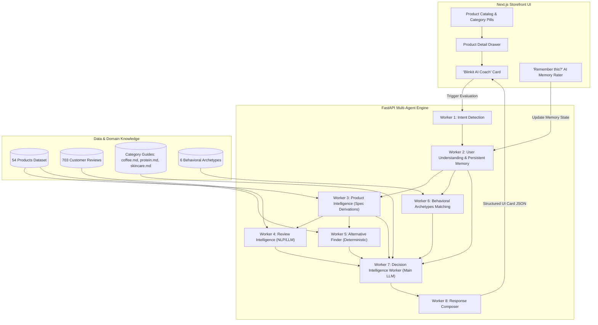

# Blinkit AI Coach — Buy with Confidence 🚀

> **AI-Native Customer Experience MVP** designed to eliminate buying hesitation when Monthly Active Customers explore unfamiliar categories on Blinkit.

---

## Executive Summary

- **Feature Identity**: **Blinkit AI Coach**
- **User-Facing Promise**: **Buy with Confidence** (*Powered by Blinkit AI*)
- **Target Categories**: Coffee, Protein Powder, Skincare (54 products total, 18 per category)
- **Primary Business KPI**: Percentage of Monthly Active Customers purchasing from at least one new category every month.
- **Core Research Insight**: Quick-commerce users come with high purchase intent but hesitate when buying from unfamiliar categories due to trust gaps, information gaps, and evaluation effort. They do not need *more recommendations*; they need **uncertainty reduction**.

---

## Product Vision

Help users confidently make first-time purchases in unfamiliar categories by reducing uncertainty through personalized AI reasoning.

> **Core Question Answered**: *"Is this the right product for me?"*

---

## Why AI?

Traditional recommendation systems optimize for product discovery using popularity, ratings, or collaborative filtering.

However, our research showed that the primary barrier is **not discovering products—it is confidently evaluating unfamiliar products**.

This requires AI because the system must:
- **Understand user intent** in context,
- **Interpret customer review semantics** across sentiment nuances,
- **Reason over structured product attributes** and specifications,
- **Apply category-specific domain knowledge** (acidity vs bitterness, lactose bloating, barrier care),
- **Compare head-to-head alternatives** dynamically,
- **Explain trade-offs in clear natural language**, and
- **Continuously learn from user feedback** memory.

These reasoning tasks cannot be achieved using rule-based recommendation algorithms alone.

---

## Presentation & Strategy Flow

```
[ AI Discovery Engine Insights ]
               │
               ▼
   [ Problem: Decision Hesitation ]
               │
               ▼
     [ Blinkit AI Coach ]
  ("Buy with Confidence" Sheet)
               │
               ▼
   [ Confident First Purchase ]
               │
               ▼
[ Category Expansion KPI Achieved ]
```

---

## Behavioral Archetypes Derived from User Research

Rather than static personas, the system matches user intent against **6 Behavioral Archetypes derived from user research**:

1. **Risk-Averse Beginner**: Seeks maximum safety, gentle formulas, instant preparation, and high forgiveness.
2. **Budget Optimizer**: Seeks maximum value per rupee, cost-per-gram efficiency, and high protein yield per rupee.
3. **Curious Explorer**: Eager to try single-origin roasts, specialty formulations, and novel active ingredients.
4. **Health First**: Prioritizes zero added sugar, clean plant ingredients, and stomach-friendly digestion (DigeZyme).
5. **Routine Shopper**: Values convenience, 10-second preparation, reliable daily performance, and trusted brand staples.
6. **Premium Seeker**: Invests in dermatologist-grade skincare, hydrolyzed whey isolates, and imported freeze-dried coffees.

---

## System Architecture & Multi-Agent Engine



### The 8 Logical AI Workers

| Worker | Name | Role | Output |
|---|---|---|---|
| **Worker 1** | Intent Detection Worker | Identifies shopping intent from contextual choice | Guidance Choice → Shopping Goal Code |
| **Worker 2** | User Understanding Worker | Tracks user profile & persistent feedback memory | User Memory + Intent → Behavioral Profile |
| **Worker 3** | Product Intelligence Worker | Computes derived metrics (flavor intensity, prep effort, risk) | Product Specs → Derived Metric Matrix |
| **Worker 4** | Review Intelligence Worker | Extracts recurring praise, watchouts & sentiment | 14 Reviews → Real Praise & Watchouts |
| **Worker 5** | Alternative Finder Worker | Retrieves top 2 category rival products deterministically | Product ID + Catalog → Competitor Pair |
| **Worker 6** | Behavioral Archetypes Worker | Matches user state to 6 Behavioral Archetypes | Profile + Archetypes → Archetype Match |
| **Worker 7** | **Decision Intelligence Worker** | Generates deep personalized decision reasoning | Workers 1-6 + Domain Guides → Fit & Trade-offs |
| **Worker 8** | Response Composer Worker | Enforces zero-hallucination UI JSON schema | Reasoning Output → UI Cards Payload |

---

## Directory Structure

```
blinkit-ai-shopping-coach/
├── backend/
│   ├── main.py                     # FastAPI server entry point
│   ├── config.py                   # Single central configuration loader
│   ├── data_loader.py              # Data manager for JSON & Markdown
│   ├── agents/
│   │   ├── orchestrator.py         # 8-Worker Multi-Agent Orchestrator
│   │   ├── worker_intent.py        # Worker 1
│   │   ├── worker_user.py          # Worker 2
│   │   ├── worker_product.py       # Worker 3
│   │   ├── worker_reviews.py       # Worker 4
│   │   ├── worker_alternatives.py  # Worker 5
│   │   ├── worker_behavior.py      # Worker 6 (Behavioral Archetypes)
│   │   ├── worker_reasoning.py     # Worker 7 (Decision Intelligence Worker)
│   │   └── worker_composer.py      # Worker 8
│   └── tests/
│       └── test_pipeline.py        # Automated test suite
├── datasets/
│   ├── products.json               # 54 Products (Coffee, Protein, Skincare)
│   ├── reviews.json                # 703 Verified Customer Reviews
│   ├── personas.json               # 6 Behavioral Archetypes
│   └── knowledge/
│       ├── coffee.md               # Roast, acidity, brewing guide
│       ├── protein.md              # Whey isolate/conc, DigeZyme, digestion guide
│       └── skincare.md             # Active ingredients, barrier repair guide
├── frontend/
│   ├── package.json
│   ├── tailwind.config.js          # Blinkit design system tokens
│   ├── src/
│   │   ├── app/
│   │   │   ├── page.tsx             # Main Blinkit Store App
│   │   │   ├── layout.tsx           # SEO layout
│   │   │   ├── error.tsx            # Error boundary
│   │   │   ├── not-found.tsx        # 404 handler
│   │   │   └── icon.svg             # Blinkit AI shield favicon
│   │   ├── components/
│   │   │   ├── Header.tsx           # Top navigation bar
│   │   │   ├── CategoryPills.tsx    # Responsive category pills
│   │   │   ├── ProductGrid.tsx      # Product catalog grid
│   │   │   ├── ProductCard.tsx      # Individual product card
│   │   │   ├── BottomSheet.tsx      # Mobile-native slide-up drawer
│   │   │   ├── BuyWithConfidence.tsx# Blinkit AI Coach card panel
│   │   │   ├── ComparativeCard.tsx  # 'Why this over similar products?'
│   │   │   ├── ExplainableCard.tsx  # 'Why you're seeing this recommendation'
│   │   │   ├── AIMemoryWidget.tsx   # 'Remember this?' past purchase rater
│   │   │   └── StickyCart.tsx       # Bottom cart bar & instant checkout
│   │   └── lib/
│   │       ├── api.ts               # Backend API client with failover
│   │       └── store.ts             # State management
├── .env                            # SINGLE CENTRAL ENVIRONMENT FILE
├── .env.example                    # Environment template
├── wrangler.toml                   # Cloudflare Workers deployment config
└── README.md                       # PM Case Study Documentation
```

---

## Local Setup & Quick Commands

```bash
# 1. Run Automated Test Suite
python -m unittest backend/tests/test_pipeline.py

# 2. Run Backend FastAPI Server (Port 8000)
python -m uvicorn backend.main:app --port 8000 --reload

# 3. Run Frontend Next.js App (Port 3000)
npm run dev
```
